# [akashraj.tech ](https://akashraj.tech)

> ---
>
> ## This is a project to port my website orignally in `PHP` to `React`
>
> ---

> - Simple Design
> - Fully Responsive
> - Theme Easily customizable => [./src/assets/styles/theme.scss](./src/assets/styles/theme.scss#L36)
> - Data Driven UI // Change Data at => [./src/data/index.js](./src/data/index.js)

> ## In the project directory, you can run:

### `yarn start`

Runs the app in the development mode. 

### `yarn build:snap`

Build and generates static snapshots for each route in `build` folder

### `yarn build`

Normal build

### `yarn test`

Launches the test runner in the interactive watch mode. 

### `yarn pretty`

Prettify the code

### `yarn analyze`

Analyze the build bundle

### `yarn screenshots:readme`

Regenerates every desktop and phone screenshot used below with a pinned Chromium
version, fixed viewports, themes, locale, timezone, reduced motion, and disabled
animations. The Stats captures use fixed API fixtures, so they also work offline
and do not drift with live GitHub data. Install the matching browser once with
`yarn playwright install chromium`.

Playwright captures into `/tmp/playwright-screenshot/akashraj-tech-readme/` before
copying the verified PNGs into `out/`.

## Deployment

Pushes to `master` deploy through GitHub Actions. The `Deploy` workflow can also
be started manually from the Actions tab.

Configure these repository secrets before running the workflow:

- `ENC_KEY`: password used to decrypt `id_rsa.enc`
- `USER`: SSH user for the production server
- `SERVER`: production server hostname

> ## Samples.

- ### Nav

  <kbd> 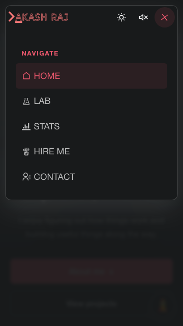 </kbd>
  <kbd> 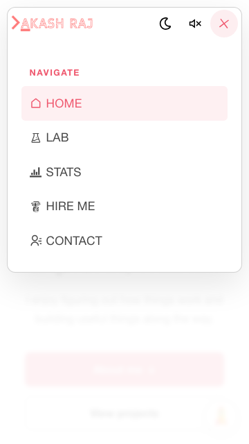 </kbd> 

- ### Home

  <kbd> 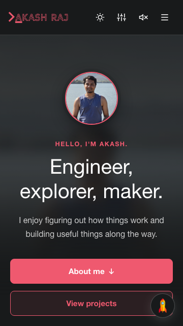 </kbd>
  <kbd> 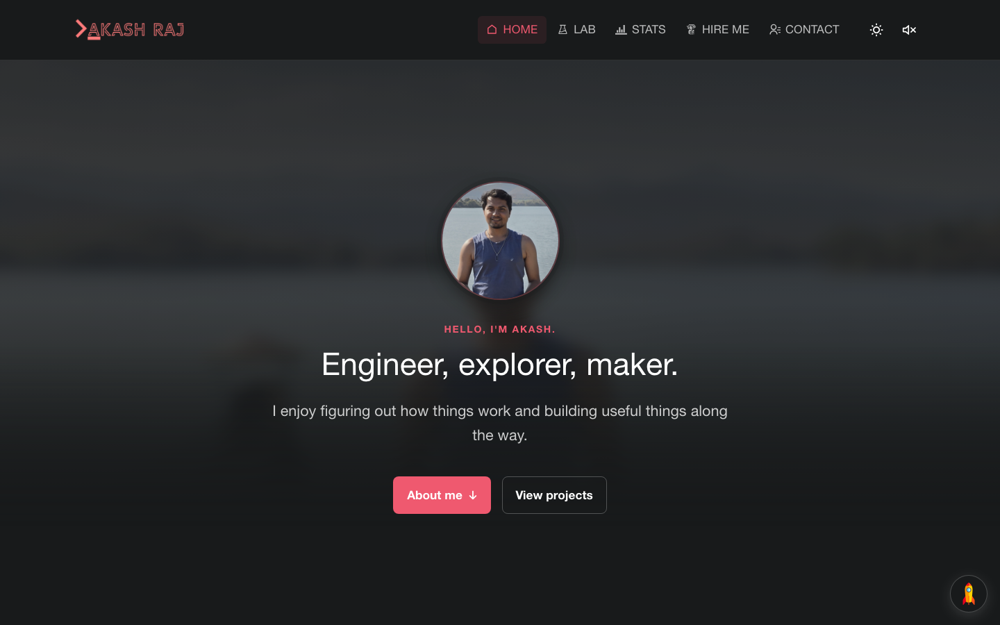 </kbd>
   
  <kbd> 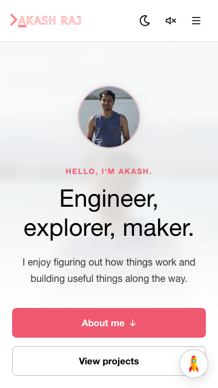 </kbd> 
  <kbd> 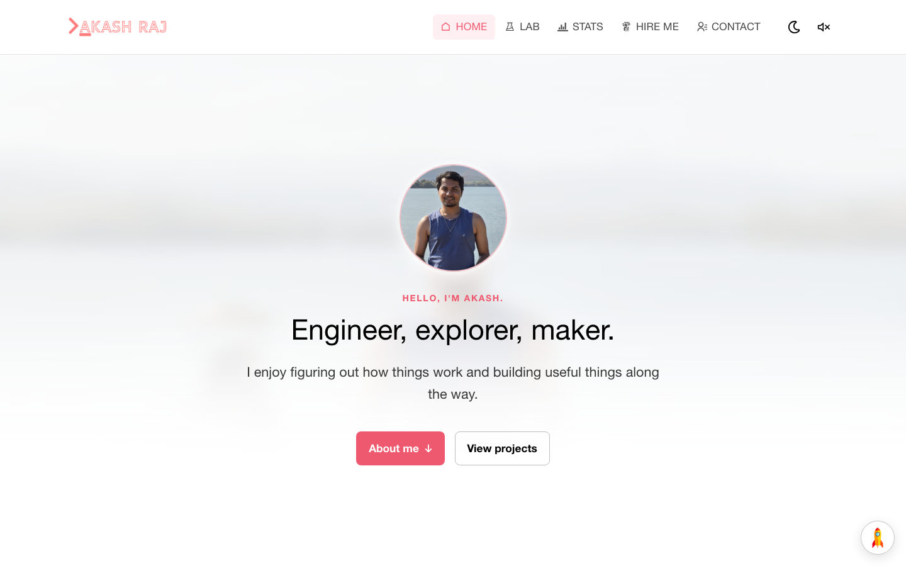 </kbd>

- ### Projects

  <kbd> 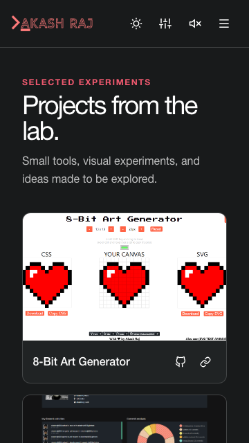 </kbd>
  <kbd> 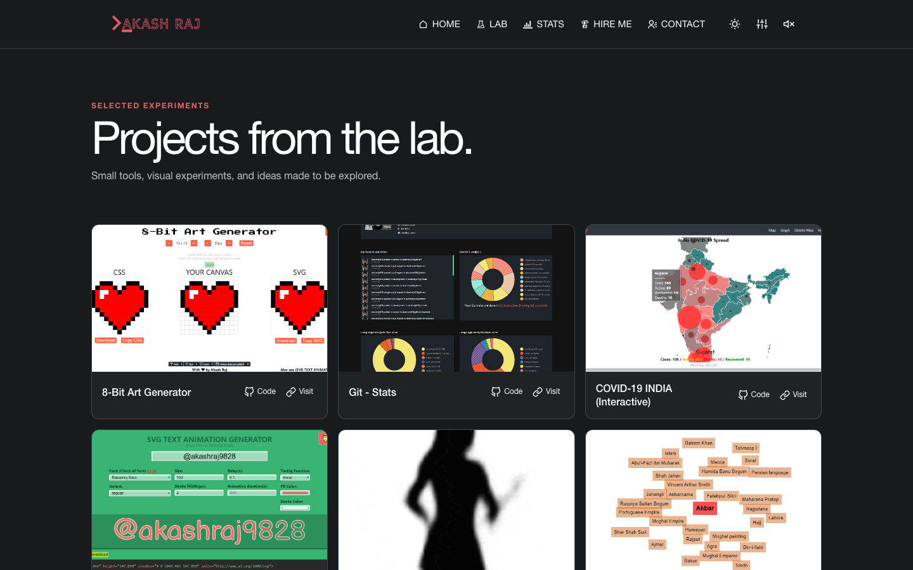 </kbd>
   
  <kbd> 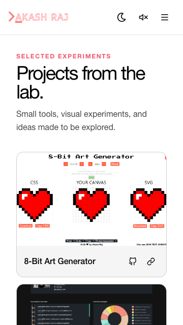 </kbd> 
  <kbd> 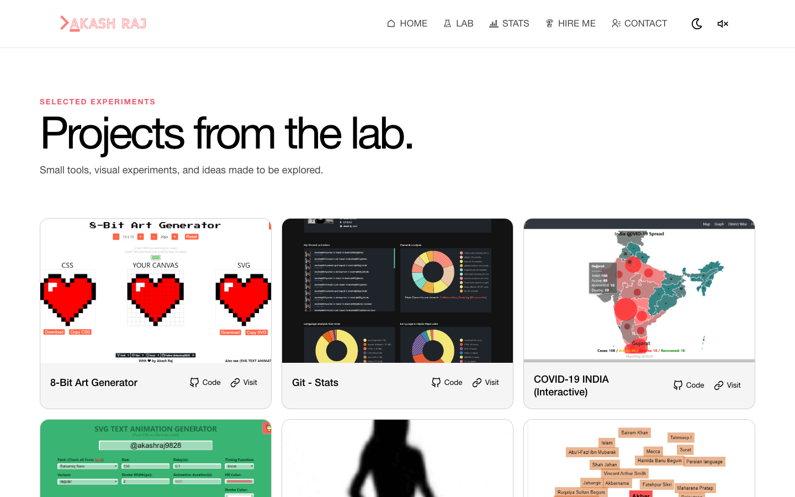 </kbd> 

- ### Resume

  <kbd> 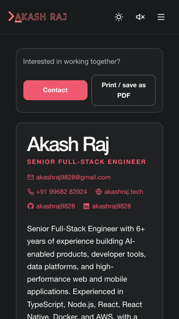 </kbd>
  <kbd> 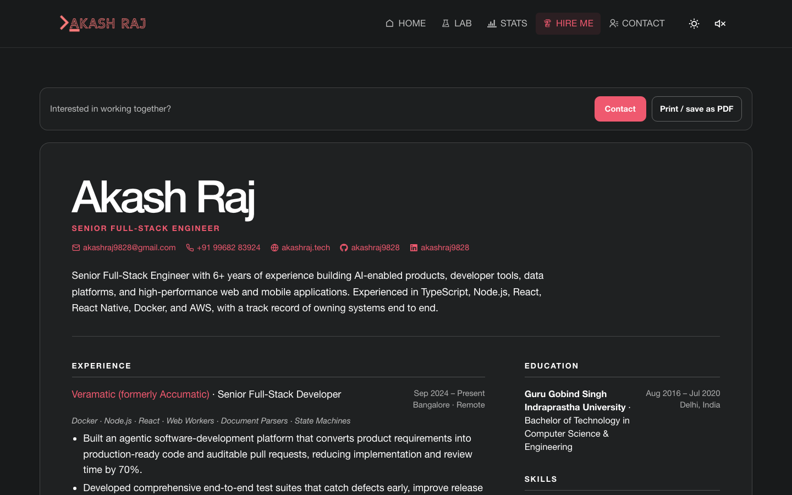 </kbd>
   
  <kbd> 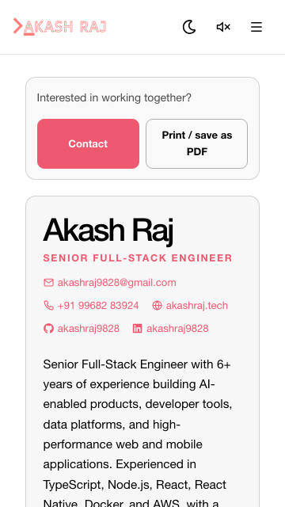 </kbd>
  <kbd> 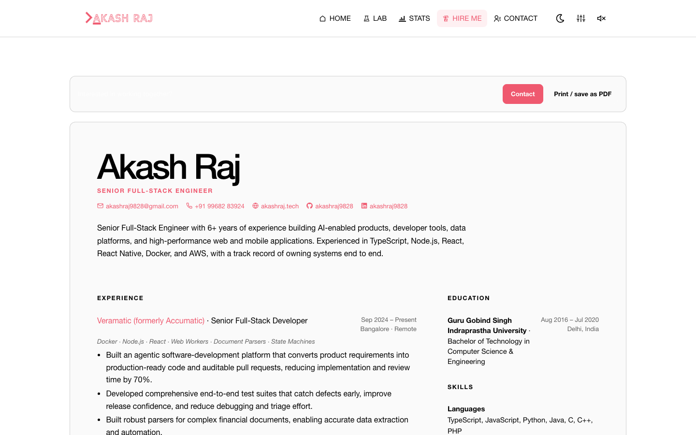 </kbd>

- ### Stats

  <kbd> 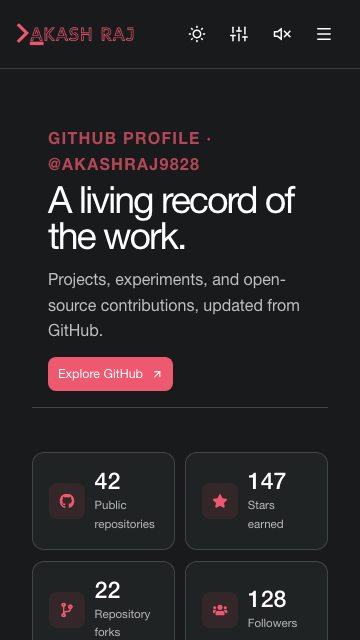 </kbd>
  <kbd> 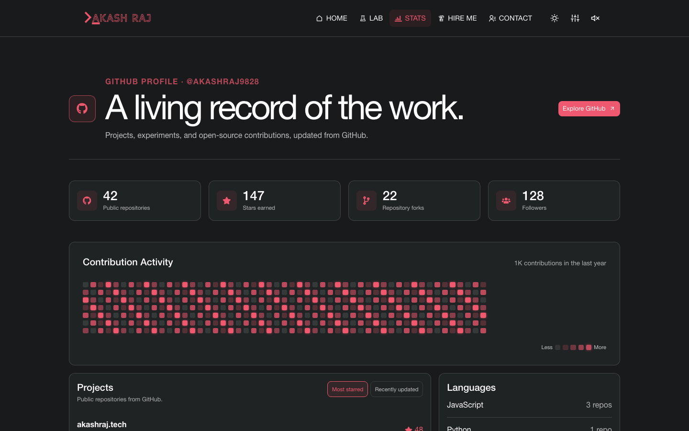 </kbd>
   
  <kbd> 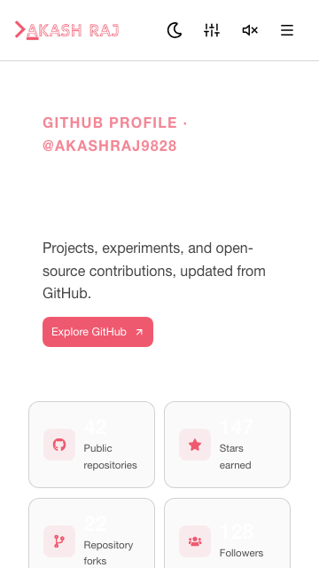 </kbd>
  <kbd> 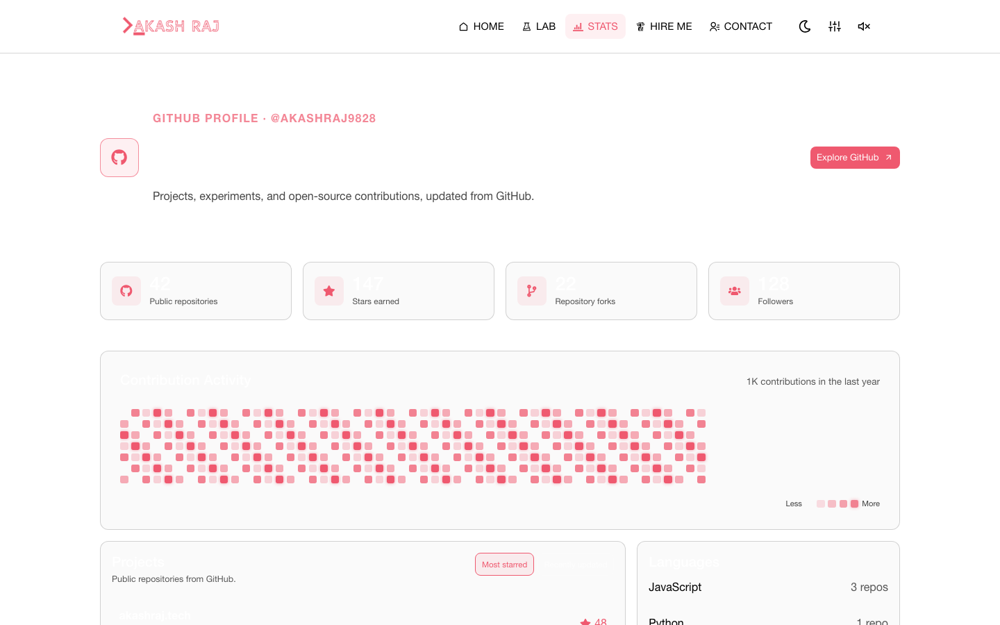 </kbd>

* ### Contact

  <kbd> 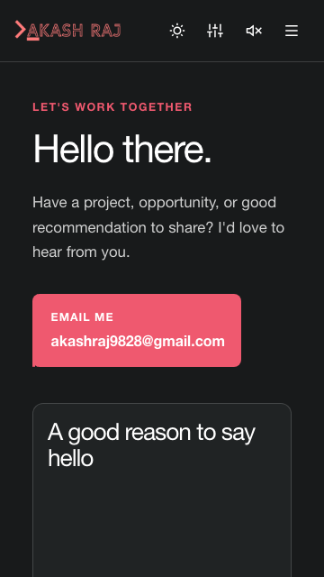 </kbd>
  <kbd> 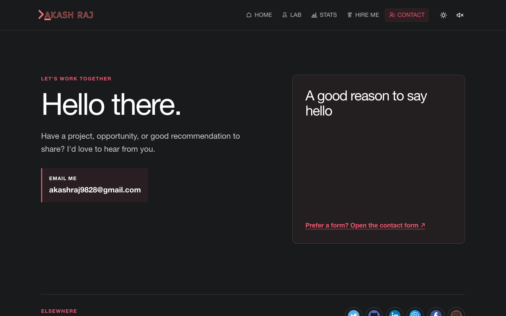 </kbd>
   
  <kbd> 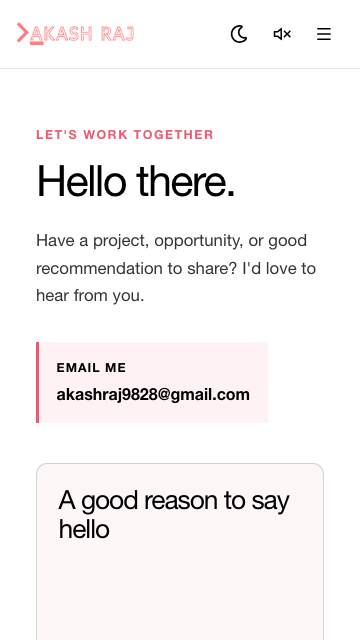 </kbd> 
  <kbd> 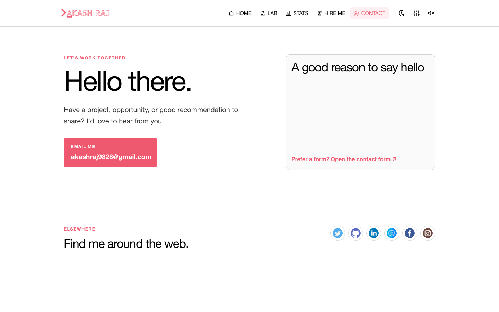 </kbd> 

