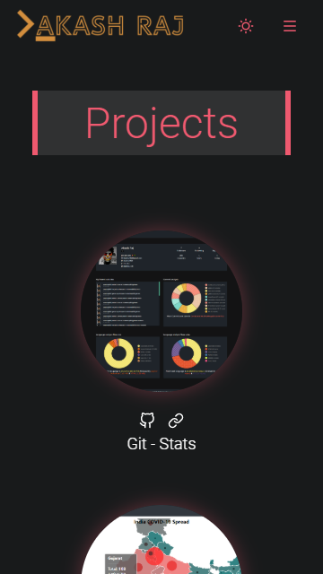

# [akashraj.tech ](https://akashraj.tech)
> ---
> ## This is a project to port my website orignally in `PHP` to `React`
> ---

> - Simple Design
> - Fully Responsive 
> - Theme Easily customizable => [./src/assets/styles/theme.scss](./src/assets/styles/theme.scss)
> - Data Driven UI // Change Data at => [./src/data/index.js](./src/data/index.js)

>  ## Samples.

 - ### Nav

  
   

 - ### Home

  
  
   
   
  

 - ### Projects

  
  
   
   
   

 - ### Projects

  
  
   
   
   

> ## In the project directory, you can run:

### `yarn start`

Runs the app in the development mode. 

### `yarn build:snap`

Build and generates static snapshots for each route in `build` folder

### `yarn build`

Normal build

### `yarn test`

Launches the test runner in the interactive watch mode. 

### `yarn pretty`

Prettify the code

### `yarn analyze`

Analyze the build bundle