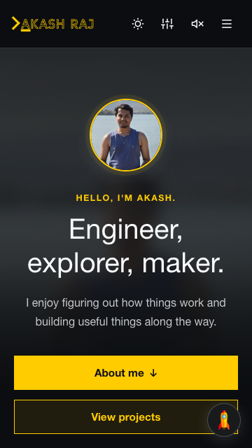
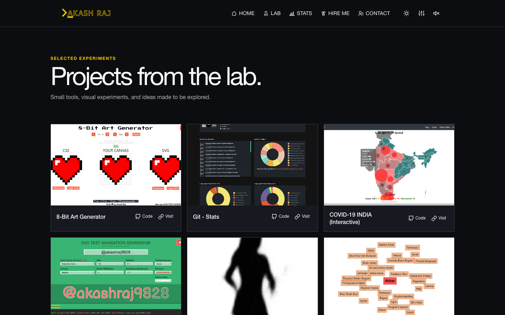
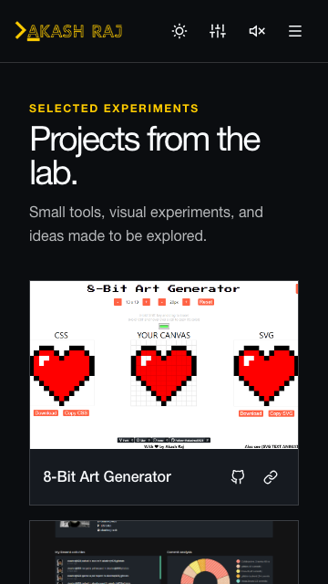
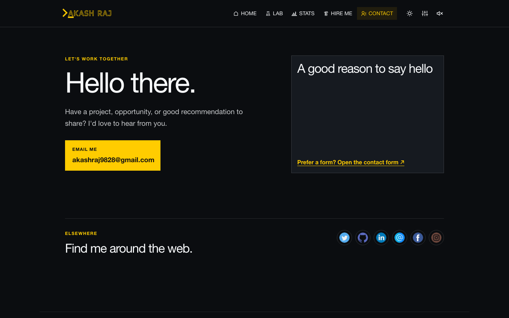
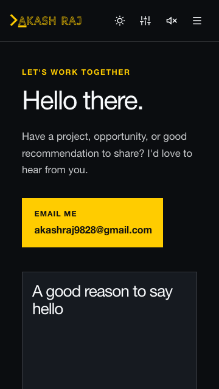
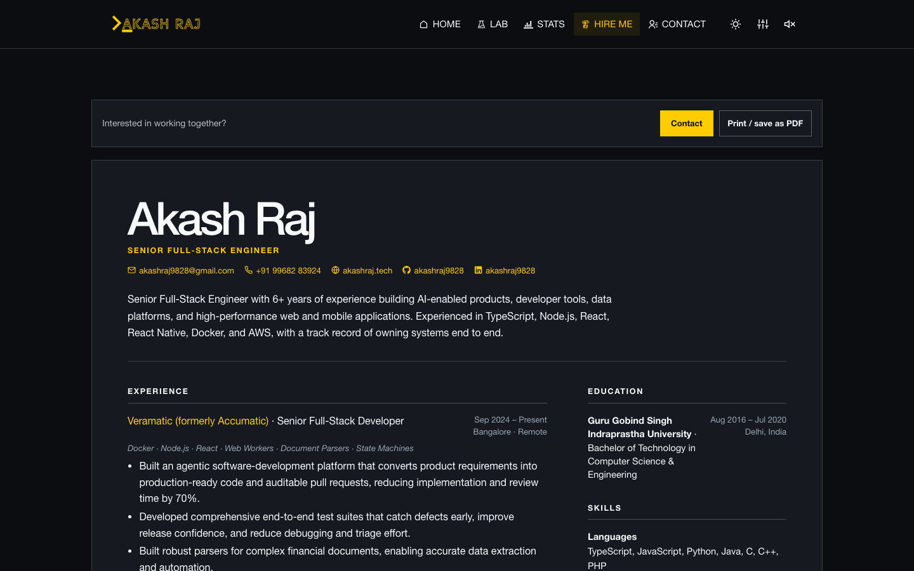
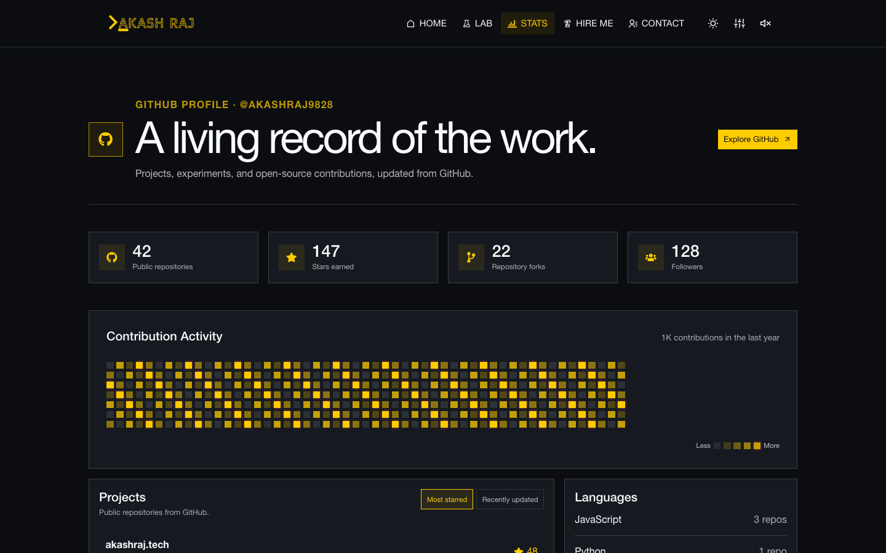
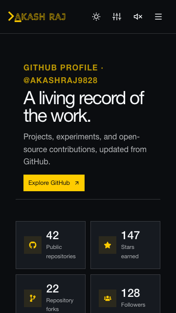
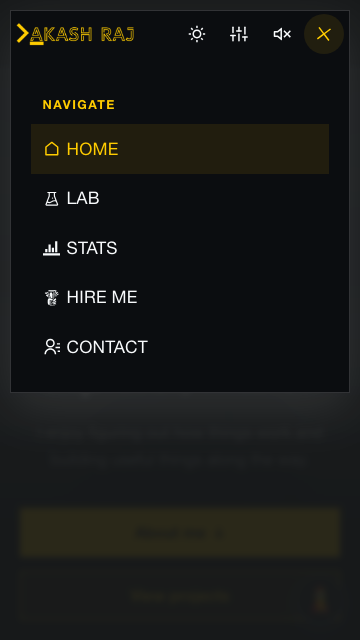

# Signal Noir

Share code: `noir`

### Home

  <kbd></kbd>
  <kbd></kbd>

### Work

  <kbd></kbd>
  <kbd></kbd>

### Contact

  <kbd></kbd>
  <kbd></kbd>

### Resume

  <kbd></kbd>
  <kbd></kbd>

### Stats

  <kbd></kbd>
  <kbd></kbd>

### Navigation

  <kbd></kbd>

